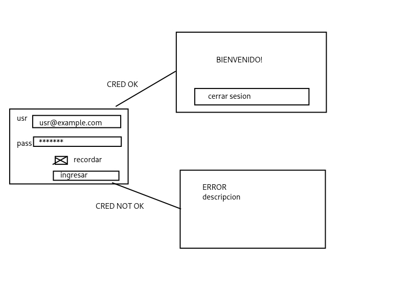
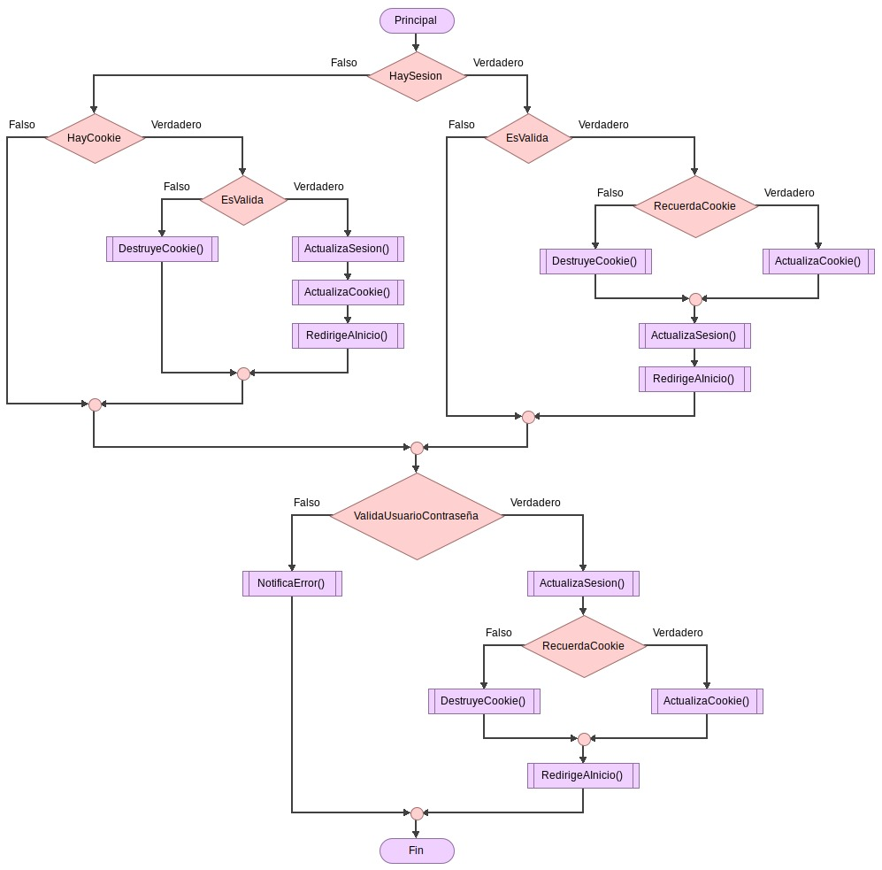

# Caso práctico 2

> 17.10.25 | 23.10.25

- Login para usuario y contraseña
- Si es exitosa, pasar a una ventana de inicio, bienvenido, dashboard
- En la página principal un boton para cerrar sesión
- Lógica para validar credenciales
- Si no pasa, una pantalla de error con su descripción, btn para regresar
- `login.php`, `inicio.php`, `error.php`
- Si se carga la página de inicio, regresar al login
- Checkbox para recordar el usuario

### *Diagrama de flujo del proceso*

Síguelo cablon😾👊

## 🔗 Enlace

**Hosting:** [https://leroy.page.gd/caso2/login.php](https://leroy.page.gd/caso2/login.php)

## 💻 Código fuente

- [Login](./login.php)  
- [Home](./home.php)
- [Error](./error.php)
