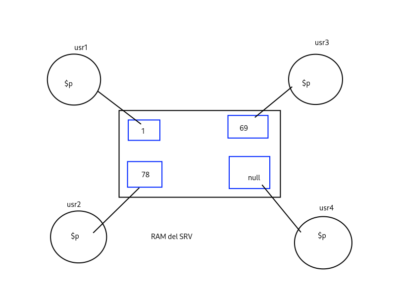

# Persistencia de datos

> 17.10.25

## Cookies

Una cookie es un dato de la app web alojada en la máquina del cliente.
* Se hace uso de un par `{K, V}`
* Se emplea una base de datos de SQLite
* Uso de la variable superglobal de php `$_COOKIE`
* Destruir una cookie: fijar tiempo 0 o en el pasado

```
    setcookie("key", "value", time() + 30);
```

Se establace una cookie con un para clave-valor: `"key" => "value"`
Con una duración de 30 segundos.

* `isset`: para comprobar si una variable existe aún

## Variable de sesión

* Es una variable depositada en la RAM del servidor web. 
* Útil para pequeñas apps web que no requieren concurrencia del orden de millones.
* Se necesita abrir una sesión antes de emplearla
* No ocupar en escenarios de concurrencia de orden de millones



* Destruir mediante `unset()`: eliminar elementos de un arreglo
```
    session_start();
    $_SESSION["key"] = value;
    unset($_SESSION["key"]);
```
