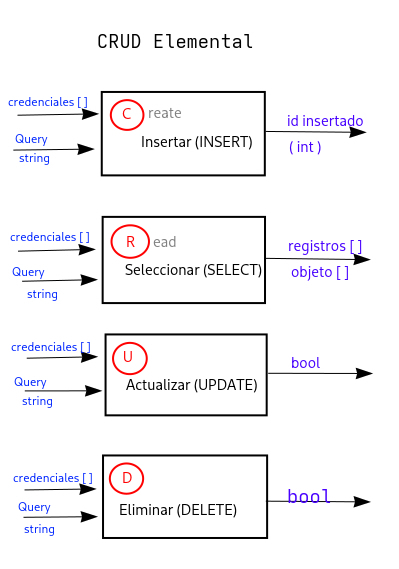

# Conexion a BD

> 23.10.25

- Driver: Viene incluido en php/ext. Habilitado ne php.ini

- Modos: Procedural (MySQLi) y OO

- Implementación: CRUD Completo

Funciones del CRUD elemental:

Librerias y frameworks

- Bootstrap
- JQuery
- Datatables
- React.js
- Angular
- Vue
- chart.js
- sweet alert
