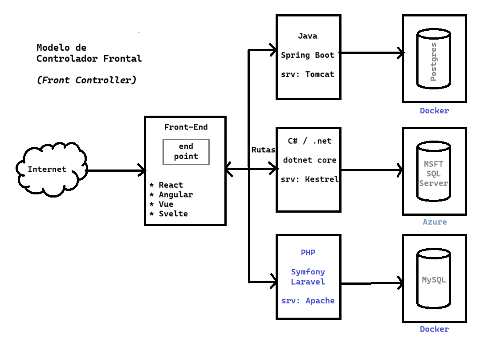
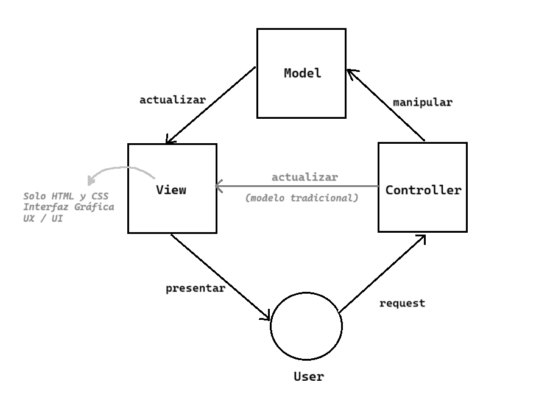
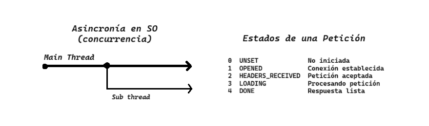

# Tendencias tecnológicas

> 13.11.25

## Modelo de controlador frontal

- Te conectas a un servidor distribuidor (Proxy de reversa)
- De acuerdo a la petición mapea a una ruta determinada
- Dicha ruta envía a otro servidor web

### Modelo Vista Controlador (MVC)

- El usuario hace una petición al **controlador**.
- El controlador manipula el **modelo**.
- El modelo manda una actualización a la **vista**.
- La vista es lo que se presenta al usuario.

## Aplicación Web Progresiva (PWA)

- Puede ser encapsulada fácilmente
- Lista para ser instalada en escritorio o móvil

## Procesamiento Asincrónico

- Proceso. Imagen de un programa cargado en memoria.
- Hebra de un proceso (hilo). Subproceso que corre en paralelo al proceso principal

