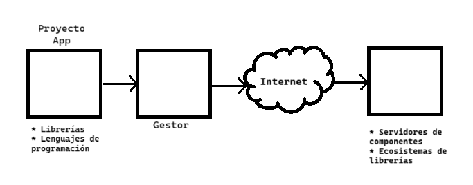

# Controlador frontal y rutas

> 20.11.25

- Sobre escritura de reglas
- Instalación de Laravel
- Gestor de componentes
  * Maven y Gradle para Java
  * NuGet para .NET (C#)
  * Compose para PHP 



### Ataques web
- Cross Site Request Forgery: Falsificación de Peticiones en Sitios Cruzados `CSRF`
- Distributed Denial of Service: Denegación de Servicio Distribuido `DDoS`
- Cross Site Scripting: Secuencia de Comandos en Sitios Cruzados `XSS`


---

### Variables de entorno

- Rutas hacia ejecutables para ser encontrados por el sistema de línea de comandos
- Las aplicaciones de programación por componentes van en APPDATA
``` Win + R => AppData```
